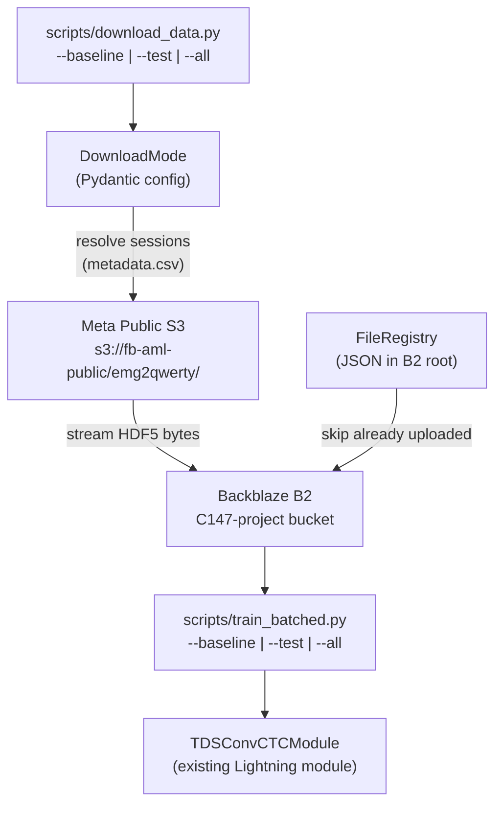

# Data Download Pipeline — Branch `data-download-1`

## Overview

Build a fully reproducible, registry-backed data pipeline to stream HDF5 sessions from Meta's public S3 bucket into Backblaze B2, with matching batched-training scripts. Divide into 14 atomic commits on branch `data-download-1`.

---

## Architecture



---

## File Map

| New File | Purpose |

|---|---|

| `src/emg2qwerty/pipeline/__init__.py` | Package init |

| `src/emg2qwerty/pipeline/config.py` | Pydantic models (B2Config, DownloadConfig, TrainBatchConfig) |

| `src/emg2qwerty/pipeline/registry.py` | FileRegistry — tracks what is already in B2 |

| `src/emg2qwerty/pipeline/downloader.py` | EMGDownloader — streams Meta S3 → B2 |

| `src/emg2qwerty/pipeline/trainer.py` | BatchTrainer — loads profiles from registry, calls Lightning |

| `scripts/download_data.py` | Click CLI: `--baseline`, `--test`, `--all`, `--dry-run` |

| `scripts/train_batched.py` | Click CLI: same flags; orchestrates batched training |

| `scripts/configure_rclone.sh` | Shell helper to generate rclone remote config for B2 |

| `config/pipeline/download.yaml` | Hydra config for download pipeline (source S3 settings) |

| `config/pipeline/b2.yaml` | Hydra config for B2 (reads creds from env via `${oc.env:…}`) |

| `.env.example` | Template for required env vars |

| `tests/test_pipeline_config.py` | Pydantic model validation tests + Hypothesis property tests |

| `tests/test_pipeline_registry.py` | Registry unit tests using `moto[s3]` mock |

| `tests/test_pipeline_downloader.py` | Downloader tests: dry-run, mode resolution, dedup |

| `tests/test_train_batched.py` | BatchTrainer: profile loading, skip-if-missing, ordering |

| `docs/pipeline/index.md` | MkDocs pipeline overview |

| `docs/pipeline/download.md` | MkDocs download script usage |

| `docs/pipeline/training.md` | MkDocs batched training usage |

| `Downloads/Styles/neurips_2024.tex` | Add Dataset & Reproducibility section to paper |

---

## Credential Strategy

Credentials are **never** in version control. The config reads from env vars via OmegaConf's `${oc.env:…}` resolver:

```yaml
# config/pipeline/b2.yaml
b2:
  endpoint: s3.us-west-004.backblazeb2.com
  region: us-west-004
  bucket_name: C147-project
  bucket_id: 857ef5759126dac299c10e13
  key_id: ${oc.env:B2_KEY_ID}
  application_key: ${oc.env:B2_APPLICATION_KEY}
```

`.env.example` (committed) and `.env` (gitignored) hold actual credentials.

---

## Commit-by-Commit Breakdown

### Commit 1 — `feat: add boto3, moto, python-dotenv deps`

- `pyproject.toml`: add `boto3>=1.34`, `botocore>=1.34`, `python-dotenv>=1.0` to `[project.dependencies]`
- `pyproject.toml`: add `moto[s3]>=4.2` to `[dependency-groups.dev]`
- Add rclone note as a `[tool.uv.scripts]` comment with `brew install rclone` instruction
- Update `.gitignore` to include `.env`, `data/`, `logs/`

### Commit 2 — `feat: pydantic pipeline config models`

New file: `src/emg2qwerty/pipeline/config.py`

- `B2Config(BaseModel)`: `endpoint`, `region`, `bucket_name`, `bucket_id`, `key_id`, `application_key` — with `@model_validator` ensuring endpoint matches expected pattern
- `SourceS3Config(BaseModel)`: `bucket` (default `fb-aml-public`), `prefix` (default `emg2qwerty`), `region` (default `us-east-1`), `anonymous` (default `True`)
- `DownloadMode(str, Enum)`: `BASELINE = "baseline"`, `TEST = "test"`, `ALL = "all"`
- `DownloadConfig(BaseModel)`: `mode`, `n_test_users` (10), `seed` (1501), `data_root` (Path), `registry_key` (`"emg2qwerty_registry.json"`), `dry_run` (False), `b2: B2Config`, `source: SourceS3Config`
- `TrainBatchConfig(BaseModel)`: `mode`, `n_test_users`, `seed`, `b2: B2Config`, `batch_size_profiles` (int, default 1)

### Commit 3 — `feat: B2-backed FileRegistry`

New file: `src/emg2qwerty/pipeline/registry.py`

```python
@dataclass
class FileRecord:
    source_key: str
    b2_key: str
    size_bytes: int
    etag: str
    uploaded_at: str  # ISO8601

class FileRegistry:
    def __init__(self, b2_client, bucket_name: str, registry_key: str): ...
    def load(self) -> None: ...          # GET registry JSON from B2
    def save(self) -> None: ...          # PUT registry JSON to B2
    def contains(self, b2_key: str) -> bool: ...
    def add(self, record: FileRecord) -> None: ...
    def pending(self, candidates: list[str]) -> list[str]: ...  # filter already-uploaded
    def all_keys(self) -> list[str]: ...
```

### Commit 4 — `feat: EMGDownloader (stream Meta S3 → B2)`

New file: `src/emg2qwerty/pipeline/downloader.py`

```python
class EMGDownloader:
    def __init__(self, config: DownloadConfig): ...
    def _make_source_client(self) -> boto3.client: ...   # anonymous S3
    def _make_b2_client(self) -> boto3.client: ...       # B2 S3-compat endpoint
    def fetch_metadata(self) -> pd.DataFrame: ...        # stream metadata.csv from source S3
    def resolve_sessions(self, metadata: pd.DataFrame) -> list[tuple[str, str]]: ...
    def _b2_key(self, user: str, session: str) -> str: ...
    def stream_one(self, user: str, session: str) -> FileRecord: ...
    def run(self) -> list[FileRecord]: ...  # main entry: load registry, filter, stream, save
```

`stream_one` uses `boto3` multipart streaming: `get_object` from source S3 then `upload_fileobj` to B2 (zero local disk usage).

### Commit 5 — `feat: Hydra pipeline configs + .env scaffold`

New files:

- `config/pipeline/download.yaml` — source S3, registry key defaults
- `config/pipeline/b2.yaml` — B2 with env-var interpolation
- `config/pipeline/train_batch.yaml` — batch_size_profiles, checkpoint dir
- `.env.example` — template with `B2_KEY_ID=` and `B2_APPLICATION_KEY=`
- Update `.gitignore` to include `.env`

### Commit 6 — `feat: download_data.py CLI`

New file: `scripts/download_data.py`

```python
@click.command()
@click.option("--baseline", "mode", flag_value="baseline")
@click.option("--test",     "mode", flag_value="test")
@click.option("--all",      "mode", flag_value="all")
@click.option("--dry-run",  is_flag=True)
@click.option("--n-test-users", default=10)
@click.option("--seed", default=1501)
def main(mode, dry_run, n_test_users, seed): ...
```

- Loads credentials from `.env` via `python-dotenv`
- Validates with `DownloadConfig` Pydantic model
- Instantiates `EMGDownloader` and calls `run()`
- Prints tqdm progress and a final summary table

### Commit 7 — `feat: train_batched.py CLI`

New file: `scripts/train_batched.py`

```python
@click.command()
@click.option("--baseline", "mode", flag_value="baseline")
@click.option("--test",     "mode", flag_value="test")
@click.option("--all",      "mode", flag_value="all")
@click.option("--config",   default="config/base.yaml")
@click.option("--checkpoint", default=None)
def main(mode, config, checkpoint): ...
```

- Uses `BatchTrainer` from `src/emg2qwerty/pipeline/trainer.py`
- Reads registry from B2 to determine which users/sessions are available
- Generates per-user Hydra overrides and calls `train.py` subprocess (or directly imports)
- Profiles are processed one at a time (or in configurable batches)

### Commit 8 — `feat: configure_rclone.sh helper`

New file: `scripts/configure_rclone.sh`

- Generates `~/.config/rclone/rclone.conf` with `[b2-c147]` remote pointing to B2 endpoint
- Used as a one-time manual setup step (not in the automated pipeline)
- Add `Makefile` target `rclone-setup: scripts/configure_rclone.sh`

### Commit 9 — `test: pydantic config validation`

New file: `tests/test_pipeline_config.py`

- `test_b2_config_valid` — instantiate with all fields
- `test_b2_config_missing_key` — expect `ValidationError`
- `test_download_mode_enum` — all three enum values
- `test_download_config_defaults` — check n_test_users=10, seed=1501
- Hypothesis `@given` test: random endpoint strings, only valid B2 pattern accepted
- `test_train_batch_config_batch_size` — batch_size_profiles > 0 validator

### Commit 10 — `test: FileRegistry with moto mock`

New file: `tests/test_pipeline_registry.py`

```python
@pytest.fixture
def mock_b2(aws_credentials):
    with moto.mock_s3():
        client = boto3.client("s3", ...)
        client.create_bucket(Bucket="C147-project")
        yield client
```

- `test_registry_starts_empty` — new bucket, registry returns empty
- `test_registry_add_and_contains` — add record, re-load, check contains
- `test_registry_pending_filters_existing` — 5 candidates, 2 already in registry → 3 pending
- `test_registry_save_load_roundtrip` — serialize/deserialize FileRecord
- `test_registry_concurrent_idempotent` — adding same key twice is idempotent

### Commit 11 — `test: EMGDownloader (dry-run + session resolution)`

New file: `tests/test_pipeline_downloader.py`

- `test_resolve_sessions_baseline` — mode=BASELINE returns exactly user `89335547` sessions from fixture metadata
- `test_resolve_sessions_test_n` — mode=TEST returns exactly `n_test_users` distinct users
- `test_resolve_sessions_all` — mode=ALL returns all users in fixture metadata
- `test_dry_run_no_upload` — dry_run=True calls resolve_sessions but makes zero S3 PUT calls (verify with mock)
- `test_dedup_skips_existing` — pre-populate registry, assert those keys not re-uploaded

### Commit 12 — `test: BatchTrainer profile ordering`

New file: `tests/test_train_batched.py`

- `test_batch_trainer_reads_registry` — mock registry with 3 profiles, assert trainer iterates 3 times
- `test_batch_trainer_skips_missing_data` — profile in registry but HDF5 not accessible → warning, skip
- `test_batch_trainer_baseline_mode` — mode=BASELINE only trains single_user profile
- `test_batch_trainer_hydra_override` — assert correct Hydra overrides generated per user

### Commit 13 — `docs: MkDocs pipeline pages`

New files:

- `docs/pipeline/index.md` — high-level architecture diagram (Mermaid), credential setup, quick-start commands
- `docs/pipeline/download.md` — `--baseline`, `--test`, `--all` usage, registry explained, rclone alternative
- `docs/pipeline/training.md` — batched training, checkpoint management, how to resume

Update files:

- `docs/.nav.yml` — add `Pipeline` section
- `docs/getting-started/data.md` — link to pipeline docs, replace manual download instructions

### Commit 14 — `docs: paper section (neurips_2024.tex)`

Edit `Downloads/Styles/neurips_2024.tex`:

Add a `\subsection{Data Acquisition Pipeline}` inside the existing Dataset/Methods section describing:

- Source (Meta S3, 200 GB, 108 users)
- Three download modes (baseline, test, all)
- Stream-to-B2 transfer (zero local disk)
- Registry-based deduplication
- Makefile targets for reproducibility
- A small table: download mode → users → sessions → approx GB

---

## Makefile Additions

```makefile
.PHONY: download-baseline download-test download-all train-baseline rclone-setup

download-baseline:
    uv run python scripts/download_data.py --baseline

download-test:
    uv run python scripts/download_data.py --test

download-all:
    uv run python scripts/download_data.py --all

train-baseline:
    uv run python scripts/train_batched.py --baseline

rclone-setup:
    bash scripts/configure_rclone.sh
```
