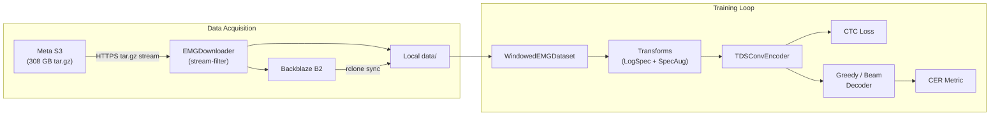
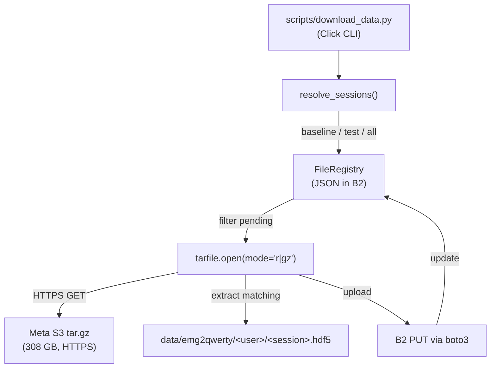

# Architecture

This page describes the full system architecture — from raw EMG signals to
predicted keystrokes — and how every component in the codebase connects.

---

## System Overview



---

## Data Layer

### HDF5 Session Files

Each recording session is a single HDF5 file (~150–400 MB) structured as:

```
emg2qwerty/
  timeseries       # Compound dataset with fields:
    emg_left       # (T, 16) — left wrist, 16 electrodes, 2 kHz
    emg_right      # (T, 16) — right wrist, 16 electrodes, 2 kHz
    time           # (T,) — timestamps in seconds
  attrs:
    session_name   # Unique session identifier
    user           # User ID (e.g. 89335547)
    condition      # "on_keyboard"
    duration_mins  # Session length in minutes
    keystrokes     # JSON array: [{key, start, end}, ...]
    prompts        # JSON array: [{payload: {text}, start, end}, ...]
```

### `EMGSessionData` (`data.py`)

Context-manager wrapper around a single HDF5 file. Provides:

- Lazy loading of EMG timeseries and keystrokes
- `ground_truth()` — returns keystroke labels as a `LabelData` named tuple
- Indexing `session[start:end]` returns a structured NumPy array

### `WindowedEMGDataset` (`data.py`)

A `torch.utils.data.Dataset` that:

1. Loads an HDF5 session via `EMGSessionData`
2. Segments the continuous EMG stream into fixed-length windows
   (`window_length=8000` samples = 4 seconds at 2 kHz)
3. Adds configurable padding for past/future context (`[1800, 200]` →
   900 ms past, 100 ms future)
4. Returns `(emg_window, labels, input_lengths, label_lengths)` tuples

### `WindowedEMGDataModule` (`lightning.py`)

PyTorch Lightning `LightningDataModule` that:

- Accepts train/val/test session lists (from Hydra config)
- Instantiates `WindowedEMGDataset` for each split
- Applies per-split transforms (augmentation for train, none for val/test)
- Creates `DataLoader` instances with collation

---

## Transform Pipeline

Transforms are defined in `config/transforms/log_spectrogram.yaml` and
implemented in `src/emg2qwerty/transforms.py`.

### Training Transforms

```
ToTensor                    # Convert numpy arrays to torch tensors
  ↓
RandomBandRotation          # Shift electrode channels by (-1, 0, +1)
  ↓
TemporalAlignmentJitter     # Random ±60 ms temporal offset
  ↓
LogSpectrogram              # STFT: n_fft=64, hop=16 → (T', 33) at 125 Hz
  ↓
SpecAugment                 # Mask 3 time bands + 2 freq bands
```

### Validation / Test Transforms

```
ToTensor → LogSpectrogram   # No augmentation
```

### Key Parameters

| Parameter | Value | Meaning |
|---|---|---|
| `n_fft` | 64 | STFT window size (32 ms at 2 kHz) |
| `hop_length` | 16 | STFT hop (8 ms) → output rate = 125 Hz |
| `n_time_masks` | 3 | SpecAugment: number of time masks |
| `time_mask_param` | 25 | Max width per time mask (200 ms at 125 Hz) |
| `n_freq_masks` | 2 | SpecAugment: number of frequency masks |
| `freq_mask_param` | 4 | Max width per frequency mask |

---

## Model Architecture

### TDS-CNN Baseline (`modules.py`, `lightning.py`)

The default model is a Time-Depth Separable CNN, following
[Hannun et al. (2019)](https://arxiv.org/abs/1904.02619):

```
Input: (T, N, bands=2, C=16, freq=33)       # LogSpectrogram of L+R EMG
  ↓
SpectrogramNorm                              # BatchNorm2d per band×channel
  ↓
MultiBandRotationInvariantMLP                # MLP + electrode-rotation pooling
  → (T, N, bands=2, mlp_features=384)
  ↓
Flatten → (T, N, 768)
  ↓
TDSConvEncoder                               # 4× (TDSConv2dBlock + FCBlock)
  ↓
Linear(768, num_classes=80)
  ↓
LogSoftmax → CTC Loss
```

#### Sub-Modules

| Module | Purpose |
|---|---|
| `SpectrogramNorm` | `BatchNorm2d` over `bands × channels` = 32 feature maps |
| `RotationInvariantMLP` | Shifts electrodes by each offset `(-1, 0, 1)`, runs MLP, mean-pools — robust to electrode placement |
| `MultiBandRotationInvariantMLP` | Applies `RotationInvariantMLP` independently to left and right wrist bands |
| `TDSConv2dBlock` | `Conv2d(C, C, (1, K))` → ReLU → skip connection → LayerNorm |
| `TDSFullyConnectedBlock` | `Linear → ReLU → Linear` → skip → LayerNorm |
| `TDSConvEncoder` | Alternating stack of conv + FC blocks |

#### Hyperparameters (`config/model/tds_conv_ctc.yaml`)

```yaml
module:
  _target_: emg2qwerty.lightning.TDSConvCTCModule
  in_features: 528          # freq × channels
  mlp_features: [384]
  block_channels: [24, 24, 24, 24]
  kernel_width: 32           # Temporal receptive field

datamodule:
  _target_: emg2qwerty.lightning.WindowedEMGDataModule
  window_length: 8000        # 4 sec at 2 kHz
  padding: [1800, 200]       # 900 ms past + 100 ms future
```

---

## Training Loop

### Hydra Configuration System

All training parameters are managed through Hydra YAML configs under `config/`:

```
config/
  base.yaml                              # Top-level defaults + trainer settings
  model/tds_conv_ctc.yaml                # Model architecture
  optimizer/adam.yaml                     # Adam: lr=1e-3
  lr_scheduler/
    linear_warmup_cosine_annealing.yaml  # 10-epoch warmup, cosine decay
    cosine_annealing.yaml
    reduce_on_plateau.yaml
    step.yaml
  decoder/
    ctc_greedy.yaml                      # Default: no LM
    ctc_beam.yaml                        # KenLM beam search
  transforms/log_spectrogram.yaml        # STFT + augmentation
  user/
    single_user.yaml                     # Baseline user (89335547)
    generic.yaml                         # Multi-user training
  cluster/
    local.yaml                           # Single-machine training
    slurm.yaml                           # SLURM cluster
```

### Entry Point (`train.py`)

```bash
uv run python -m emg2qwerty.train [HYDRA_OVERRIDES...]
```

This:

1. Loads the composed Hydra config
2. Instantiates the `WindowedEMGDataModule` and `TDSConvCTCModule`
3. Creates a `pl.Trainer` with configured callbacks (LR monitor, checkpointing)
4. Calls `trainer.fit()` if `train=True`, then `trainer.test()`

### Key Training Parameters (`config/base.yaml`)

| Parameter | Default | Description |
|---|---|---|
| `seed` | 1501 | Random seed for reproducibility |
| `batch_size` | 32 | Mini-batch size |
| `num_workers` | 4 | DataLoader worker processes |
| `trainer.max_epochs` | 150 | Training epochs |
| `trainer.accelerator` | `gpu` | Device type |
| `monitor_metric` | `val/CER` | Checkpoint selection metric |
| `dataset.root` | `data` | HDF5 file root directory |

### Optimizer & LR Schedule

- **Optimizer**: Adam with `lr=1e-3`
- **LR Schedule**: Linear warmup (10 epochs, from `1e-8`) → cosine annealing to `1e-6`

---

## Decoding

### `CTCGreedyDecoder` (`decoder.py`)

The default decoder. Performs argmax at each timestep, then collapses
consecutive duplicates and removes blanks. No external dependencies required.

```bash
uv run python -m emg2qwerty.train decoder=ctc_greedy ...
```

### `CTCBeamDecoder` (`decoder.py`)

Beam search with optional n-gram language model (KenLM) rescoring.

| Parameter | Default | Description |
|---|---|---|
| `beam_size` | 50 | Number of beams |
| `max_labels_per_timestep` | 10 | Labels expanded per step |
| `lm_path` | `models/lm/wikitext-103-6gram-charlm.bin` | KenLM binary |
| `lm_weight` | 2.0 | LM score weight |
| `insertion_bonus` | 2.0 | Bonus for inserting characters |
| `delete_key` | `Key.backspace` | Character mapped to deletion |

```bash
uv run python -m emg2qwerty.train decoder=ctc_beam ...
```

!!! note "KenLM required"
    The beam-search decoder requires [KenLM](https://github.com/kpu/kenlm) to
    be installed. See [Setup → KenLM](getting-started/setup.md#kenlm-beam-search-decoder)
    for installation instructions.

### Building the Character Language Model

The 6-gram character LM is built from WikiText-103:

```bash
# Build kenlm C++ tools first:
# https://github.com/kpu/kenlm#compiling

# Then build the 6-gram char LM:
./scripts/lm/build_char_lm.sh 6
```

This produces:

- `models/lm/wikitext-103-6gram-charlm.arpa` — human-readable ARPA format
- `models/lm/wikitext-103-6gram-charlm.bin` — fast binary format (used at inference)

---

## Metrics (`metrics.py`)

The primary evaluation metric is **Character Error Rate (CER)**:

$$\text{CER} = \frac{\text{edit\_distance}(\text{prediction}, \text{reference})}{\text{len}(\text{reference})}$$

The `CharacterErrorRates` module also reports decomposed error types:

| Metric | Meaning |
|---|---|
| **CER** | Overall character error rate |
| **IER** | Insertion error rate |
| **DER** | Deletion error rate |
| **SER** | Substitution error rate |

---

## Data Pipeline

The data pipeline handles acquisition of HDF5 files from Meta's public S3
archive and storage in Backblaze B2 for reproducible access.

### Architecture



### Key Classes

| Class | File | Purpose |
|---|---|---|
| `B2Config` | `pipeline/config.py` | Pydantic model for B2 credentials (from env vars) |
| `SourceS3Config` | `pipeline/config.py` | Tar.gz URL + archive prefix |
| `DownloadConfig` | `pipeline/config.py` | Mode, seed, data root, dry-run flag |
| `FileRegistry` | `pipeline/registry.py` | JSON-backed dedup manifest stored in B2 |
| `FileRecord` | `pipeline/registry.py` | Frozen dataclass for each uploaded file |
| `EMGDownloader` | `pipeline/downloader.py` | Orchestrates tar.gz streaming + extraction |
| `BatchTrainer` | `pipeline/trainer.py` | Multi-profile training orchestration |

### Deduplication

The `FileRegistry` stores a JSON manifest as an object in the B2 bucket
(`emg2qwerty_registry.json`). Before streaming the tar.gz, the downloader
checks both:

1. The B2 registry (has this file been uploaded before?)
2. The local filesystem (does the file already exist in `data/`?)

Only files missing from **both** are extracted and uploaded.

---

## Configuration Reference

### Hydra Config Groups

| Group | Options | Default |
|---|---|---|
| `user` | `single_user`, `generic` | `single_user` |
| `model` | `tds_conv_ctc` | `tds_conv_ctc` |
| `optimizer` | `adam` | `adam` |
| `lr_scheduler` | `linear_warmup_cosine_annealing`, `cosine_annealing`, `reduce_on_plateau`, `step` | `linear_warmup_cosine_annealing` |
| `decoder` | `ctc_greedy`, `ctc_beam` | `ctc_greedy` |
| `transforms` | `log_spectrogram` | `log_spectrogram` |
| `cluster` | `local`, `slurm` | `local` |

### Override Examples

```bash
# Change optimizer + LR schedule
uv run python -m emg2qwerty.train optimizer=adam lr_scheduler=cosine_annealing

# Use beam decoder
uv run python -m emg2qwerty.train decoder=ctc_beam

# Train on generic (multi-user) split
uv run python -m emg2qwerty.train user=generic

# Evaluation only, from checkpoint
uv run python -m emg2qwerty.train \
  train=False checkpoint=logs/best.ckpt decoder=ctc_greedy

# Adjust batch size + workers
uv run python -m emg2qwerty.train batch_size=64 num_workers=8
```

---

## Testing

### Run All Unit Tests

```bash
make test
# or equivalently:
uv run pytest -p no:cacheprovider -m "not slow and not integration" -n auto
```

### Run Integration Tests (requires B2 credentials + network)

```bash
uv run pytest -m integration -v -s
```

### Test Structure

| File | Covers |
|---|---|
| `test_charset.py` | Key ↔ label ↔ unicode mapping roundtrips |
| `test_data.py` | Label data creation from keystroke strings |
| `test_decoder.py` | Greedy + beam decoders, kenlm LM scoring |
| `test_pipeline_config.py` | Pydantic config validation (B2, download, training) |
| `test_pipeline_registry.py` | FileRegistry CRUD, save/load roundtrip (moto-mocked S3) |
| `test_pipeline_downloader.py` | EMGDownloader session resolution, dry-run, dedup |
| `test_train_batched.py` | BatchTrainer profile resolution, Hydra overrides |
| `test_integration_baseline.py` | End-to-end: B2 connectivity, tar.gz stream, HDF5 validation |
