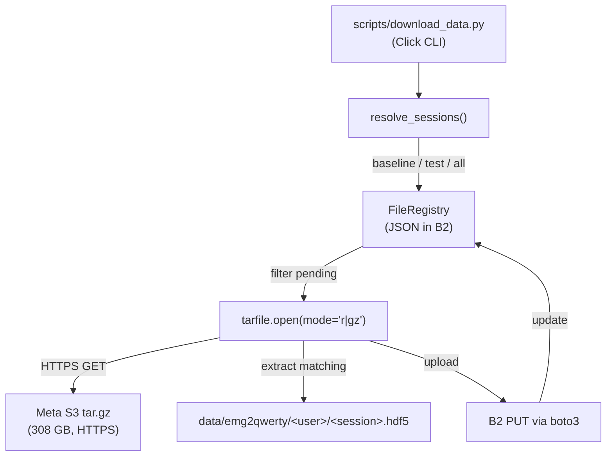

# Data Pipeline

The data pipeline handles acquisition of HDF5 files from Meta's public S3
archive and storage in Backblaze B2 for reproducible access.

---

## Architecture

---

## Key Classes

| Class | File | Purpose |
|---|---|---|
| `B2Config` | `pipeline/config.py` | Pydantic model for B2 credentials (from env vars) |
| `SourceS3Config` | `pipeline/config.py` | Tar.gz URL + archive prefix |
| `DownloadConfig` | `pipeline/config.py` | Mode, seed, data root, dry-run flag |
| `FileRegistry` | `pipeline/registry.py` | JSON-backed dedup manifest stored in B2 |
| `FileRecord` | `pipeline/registry.py` | Frozen dataclass for each uploaded file |
| `EMGDownloader` | `pipeline/downloader.py` | Orchestrates tar.gz streaming + extraction |
| `BatchTrainer` | `pipeline/trainer.py` | Multi-profile training orchestration |

---

## Deduplication

The `FileRegistry` stores a JSON manifest as an object in the B2 bucket
(`emg2qwerty_registry.json`). Before streaming the tar.gz, the downloader
checks both:

1. The B2 registry (has this file been uploaded before?)
2. The local filesystem (does the file already exist in `data/`?)

Only files missing from **both** are extracted and uploaded.
