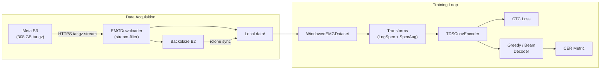

# Architecture

This section describes the full system architecture — from raw EMG signals to
predicted keystrokes — and how every component in the codebase connects.

---

## System Overview

---

## Sections

| Page | Covers |
|---|---|
| [Data Layer](data-layer.md) | HDF5 session files, `EMGSessionData`, `WindowedEMGDataset`, `WindowedEMGDataModule` |
| [Transform Pipeline](transforms.md) | LogSpectrogram, SpecAugment, RandomBandRotation |
| [Model Architecture](model.md) | TDS-CNN baseline, sub-modules, hyperparameters |
| [Training Loop](training.md) | Hydra config, entry point, optimizer & LR schedule |
| [Decoding](decoding.md) | Greedy decoder, beam search, KenLM language model |
| [Metrics](metrics.md) | CER, IER, DER, SER |
| [Data Pipeline](data-pipeline.md) | EMGDownloader, B2 registry, deduplication |
| [Configuration Reference](configuration.md) | Hydra config groups, override examples |
| [Testing](testing.md) | Unit tests, integration tests, test structure |
