# Experiment Results

## Final CER Comparison — All Architectures

All experiments trained on user 89335547 (single user, greedy CTC decoding, no language model),
on an 8×H200 Verda instance with one experiment per GPU.

### Full Results Table
| Architecture | Params | Val CER (%) | Test CER (%) | Val Loss | Test Loss | Best Epoch | Notes |
|---|---|---|---|---|---|---|---|
| **TDS-ConvNet (baseline)** | 5.3M | **19.45** | **22.48** | 1.017 | 1.184 | 124/150 | Branch 2 results used (lower CER on both splits) |
| **CNN + BiLSTM** | — | **13.76** | **14.89** | — | — | 132 | Best overall; greedy decoder |
| BiLSTM (bidir) | — | 15.37 | 22.07 | — | — | 132 | Plain recurrent encoder |
| Whisper-CTC | — | 17.72 | 99.91 | — | — | — | Whisper-tiny transfer; val improved, test generalization collapsed |
| **Large Transformer + CNN** | ~5M | **16.79** | 78.52 | 0.532 | 4.910 | 76/80 | Strong val CER but significant train/test gap |
| Small Transformer + CNN | ~1.3M | 28.71 | 67.54 | 0.862 | 3.030 | 77/80 | |
| Trans + CNN, LR=5e-4 | ~1.3M | 39.52 | 58.81 | 1.219 | 2.049 | 78/80 | Higher LR hurts val |
| Trans + CNN + blank penalty | ~1.3M | 47.76 | 64.82 | 49.57 | 50.89 | 78/80 | Blank penalty destabilizes loss |
| Pure Transformer (no CNN) | ~1.3M | 48.76 | 84.78 | 1.265 | 5.218 | 79/80 | |
| Trans + blank penalty (no CNN) | ~1.3M | 94.84 | 98.92 | 50.25 | 52.87 | 74/80 | Blank penalty + no CNN: collapsed |
| Tiny Transformer (d=64) | ~300K | 96.37 | 100.0 | 77.73 | 66.26 | 1/80 | Undertrained / too small |

## RTX PRO 6000 Campaign

The active troubleshooting campaign runs on an on-demand Verda instance with
`8x RTX PRO 6000` GPUs and treats the machine as an 8-lane experiment cluster.
The governing rule is `1 GPU = 1 independent run`; the campaign does not use
standard DDP for core CTC training because earlier 8-GPU DDP experiments caused
blank-collapse by reducing each GPU to too few warmup steps.

### Active Wave Ledger

Use this table to track live and recently completed runs for the
`yahvin/transformer-troubleshoot` branch.

| Wave | GPU slot | Model | Commit SHA | Inference mode | Train windows | Positional encoding | Frontend | Decoder | Status | Checkpoint | Train CER | Val CER | Test CER | Notes |
|---|---:|---|---|---|---|---|---|---|---|---|---:|---:|---:|---|
| wave-0-docs | 0 | docs foundation | pending | n/a | n/a | n/a | n/a | n/a | completed | — | — | — | — | initial ledger scaffold |
| wave-1-inference | 0 | Large CNN + Transformer | pending | `full_session` | `4s` | sinusoidal | spectrogram | greedy | completed | `wave0_gpu1_transformer_large_control` | — | 57.95 | 68.06 | clean best checkpoint |
| wave-1-inference | 1 | Large CNN + Transformer | pending | `windowed_chunk_decode` | `4s` | sinusoidal | spectrogram | greedy | planned | — | — | — | — | chunk decode |
| wave-1-inference | 2 | Large CNN + Transformer | pending | `windowed_logits_merge` | `4s` | sinusoidal | spectrogram | greedy | completed | `wave0_gpu1_transformer_large_control` | — | 57.95 | 66.76 | improves test CER over full session |
| wave-1-inference | 3 | Small CNN + Transformer | pending | `windowed_logits_merge` | `4s` | sinusoidal | spectrogram | greedy | completed | `wave0_gpu2_transformer_small_control` | — | 28.47 | 59.84 | current best transformer |
| wave-1-inference | 4 | Whisper-CTC | pending | `windowed_logits_merge` | `4s` | n/a | spectrogram | greedy | planned | — | — | — | — | transfer control |
| wave-1-inference | 5 | TDS-ConvNet | pending | `windowed_logits_merge` | `4s` | n/a | spectrogram | greedy | planned | — | — | — | — | local control |
| wave-1-inference | 6 | Large CNN + Transformer | pending | `windowed_logits_merge` | `4s` | sinusoidal | spectrogram | greedy | planned | — | — | — | — | alt stride |
| wave-1-inference | 7 | Large CNN + Transformer | pending | `windowed_logits_merge` | `4s` | sinusoidal | spectrogram | greedy | planned | — | — | — | — | alt trim |

### Final Leaderboard (All Waves — Best Results)

| Rank | Model | Epochs | Decoder | Inference | Val CER | Test CER | Gap | Notes |
|---:|---|---:|---|---|---:|---:|---:|---|
| **1** | **CNN-BiLSTM (150ep)** | 150 | **beam+LM** | full_session | **9.39** | **7.95** | **−1.44** | **🏆 Overall best** |
| **2** | **CNN-BiLSTM (300ep)** | 300 | **beam+LM** | full_session | **9.11** | **8.47** | **−0.64** | Longer training, slightly worse test |
| **3** | **ALiBi Transformer** | 150 | **beam+LM** | windowed | **10.97** | **8.84** | **−2.13** | **🏆 Best transformer** |
| 4 | CNN-BiLSTM deep-CNN | 200 | beam+LM | full_session | 11.72 | 9.55 | −2.17 | 3-layer CNN, tight gap |
| 5 | ALiBi Transformer | 150 | beam+LM | windowed | 10.97 | 9.88 | −1.09 | replicated eval |
| 6 | BiLSTM-only | 200 | beam+LM | full_session | 9.97 | 10.72 | 0.75 | no CNN, still competitive |
| 7 | CNN-BiLSTM (300ep) | 300 | greedy | full_session | 12.36 | 13.81 | 1.45 | best greedy |
| 8 | CNN-BiLSTM (150ep) | 150 | greedy | full_session | 13.00 | 14.96 | 1.96 | strong greedy baseline |
| 9 | CNN-BiLSTM-Transformer | 150 | beam+LM | windowed | 9.64 | 14.11 | 4.47 | hybrid, beam helps |
| 10 | CNN-BiLSTM deep-CNN | 200 | greedy | full_session | 14.58 | 14.80 | 0.22 | tightest greedy gap |
| 11 | CNN-BiLSTM wide | 200 | greedy | full_session | 14.62 | 16.08 | 1.46 | wider LSTM |
| 12 | ALiBi Transformer | 150 | greedy | windowed | 17.41 | 17.59 | 0.18 | ALiBi fixes length gap |
| 13 | BiLSTM-only | 200 | greedy | full_session | 15.11 | 18.31 | 3.20 | no CNN |
| 14 | TDS-ConvNet | 150 | greedy | full_session | 19.45 | 22.48 | 3.03 | original baseline |
| 15 | CNN-BiLSTM-Transformer | 150 | greedy | windowed | 13.49 | 22.97 | 9.48 | hybrid windowed |
| 16 | CNN-BiLSTM-Transformer | 150 | greedy | full_session | 13.49 | 38.34 | 24.85 | transformer adds gap |
| 17 | Hybrid 300ep | 300 | greedy | full_session | 13.03 | 49.49 | 36.46 | longer doesn't help gap |
| 18 | Large Transformer | 150 | beam+LM | windowed | 9.37 | 81.07 | 71.70 | sinusoidal PE broken |
| 19 | Large Transformer | 150 | greedy | windowed | 14.51 | 82.02 | 67.51 | windowing barely helps |
| 20 | Small Transformer | 150 | greedy | full_session | 15.15 | 87.21 | 72.06 | severe length gap |
| 21 | Whisper-CTC | 150 | greedy | full_session | 19.30 | 100.0 | 80.70 | complete test failure |

### Wave 11: CER Push Training Results (Greedy)

| Architecture | Config | Epochs | Val CER | Test CER | Gap | Notes |
|---|---|---:|---:|---:|---:|---|
| **CNN-BiLSTM 300ep** | h=384, 2L, [512,512] | 300 | **12.36** | **13.81** | 1.45 | Improved greedy from 13.00→12.36 |
| CNN-BiLSTM wide | h=512, 2L, [512,512] | 200 | 14.62 | 16.08 | 1.46 | Wider LSTM didn't help |
| CNN-BiLSTM deep-CNN | h=384, 2L, [528,512,512] | 200 | 14.58 | 14.80 | **0.22** | **Tightest val/test gap** |
| BiLSTM-only | h=512, 3L | 200 | 15.11 | 18.31 | 3.20 | No CNN, still reasonable |
| Hybrid 300ep | LSTM+Trans | 300 | 13.03 | 49.49 | 36.46 | Longer training worsens test |
| Hybrid large-LSTM | h=384, 3L LSTM + small Trans | 200 | 18.96 | 37.93 | 18.97 | Larger LSTM didn't help |

### Wave 11: Beam Search Results

| Architecture | Decoder | Inference | Val CER | Test CER | IER | DER | SER | Notes |
|---|---|---|---:|---:|---:|---:|---:|---|
| **CNN-BiLSTM 300ep** | beam+LM | full_session | **9.11** | **8.47** | 2.38 | 0.67 | 5.42 | Close to #1 (7.95) |
| CNN-BiLSTM deep-CNN | beam+LM | full_session | 11.72 | 9.55 | 2.31 | 0.78 | 6.46 | Sub-10% with 3-layer CNN |
| ALiBi Transformer | beam+LM | windowed | 10.97 | 9.88 | 4.28 | 0.76 | 4.84 | Transformer sub-10% |
| BiLSTM-only | beam+LM | full_session | 9.97 | 10.72 | 2.18 | 1.56 | 6.98 | No CNN, still sub-11% |

### Key Findings

1. **KenLM beam search** cuts CER roughly in half vs. greedy decoding (CNN-BiLSTM: 14.96→7.95, ALiBi: 17.59→8.84)
2. **ALiBi positional encoding** dramatically improves transformer length generalization: val/test gap goes from 72% (sinusoidal) to 0.18% (ALiBi) with windowed inference
3. **Windowed logits merge** is essential for transformer architectures at test time but slightly hurts models without length issues (CNN-BiLSTM)
4. **CNN-BiLSTM** remains the strongest single architecture, while **ALiBi Transformer + beam search** brings transformers to competitive test-time performance
5. **Longer training (300ep)** marginally improves greedy CER (13.00→12.36) but the 150ep model with beam search (7.95%) still beats the 300ep beam result (8.47%)
6. **Deep CNN (3-layer)** achieves the tightest val/test gap of only 0.22% with greedy decoding
7. **Sinusoidal PE transformers** cannot be rescued even with beam search + windowed inference (81.07% test CER)

### Inference Policy Comparison (Wave 10)

| Policy | Model | Val CER | Test CER (full) | Test CER (windowed) | Improvement | Notes |
|---|---|---:|---:|---:|---:|---|
| `full_session` | CNN-BiLSTM | 13.00 | 14.96 | — | — | no length gap |
| `windowed_logits_merge` | CNN-BiLSTM | 13.00 | — | 16.21 | −1.25 | windowing slightly hurts |
| `full_session` | CNN-BiLSTM-Transformer | 13.49 | 38.34 | — | — | transformer causes gap |
| `windowed_logits_merge` | CNN-BiLSTM-Transformer | 13.49 | — | 22.97 | +15.37 | windowing helps transformer |
| `full_session` | ALiBi Transformer | 17.41 | OOM | — | — | OOM on full test session |
| `windowed_logits_merge` | **ALiBi Transformer** | 17.41 | — | **17.59** | **solved** | **ALiBi + windowing = no gap** |
| `full_session` | Large Transformer | 14.51 | 85.95 | — | — | severe length gap |
| `windowed_logits_merge` | Large Transformer | 14.51 | — | 82.02 | +3.93 | slight improvement |

### Position Encoding Comparison

| Model | Train windows | Inference mode | Sinusoidal Val/Test | ALiBi Val/Test | RoPE Val/Test | Winner | Notes |
|---|---|---|---|---|---|---|---|
| Large CNN + Transformer | pending | pending | pending | pending | pending | pending | wave not yet run |

### Variable-Length Window Sweep

| Model | Train window lengths | Sampling weights | Inference mode | Val CER | Test CER | Gap | Status | Notes |
|---|---|---|---|---:|---:|---:|---|---|
| Large CNN + Transformer | `[8000]` | `[1.0]` | pending | — | — | — | planned | fixed-length control |
| Large CNN + Transformer | `[8000,16000]` | `[1.0,1.0]` | pending | — | — | — | planned | first multi-length regime |
| Large CNN + Transformer | `[8000,16000,24000]` | `[1.0,1.0,1.0]` | pending | — | — | — | planned | broader range |
| Large CNN + Transformer | `[8000,16000,24000,32000]` | `[1.0,1.0,1.0,1.0]` | pending | — | — | — | planned | max planned regime |

### Architecture Sweep (Wave 9 — 150 epochs, single GPU, no DDP)

| Family | Frontend | Encoder | Params | Positional encoding | Decoder | Val CER | Test CER | Gap | Status | Notes |
|---|---|---|---:|---|---|---:|---:|---:|---|---|
| recurrent | spectrogram | CNN + BiLSTM | 10.1M | n/a | greedy | **13.00** | **14.96** | 1.96 | completed | **best overall** — minimal val/test gap |
| hybrid | spectrogram | CNN + BiLSTM + Transformer | 8.1M | sinusoidal | greedy | 13.49 | 38.34 | 24.85 | completed | transformer adds test-time gap |
| transformer | spectrogram | Small Transformer (d=128, 4L) | 1.6M | sinusoidal | greedy | 15.15 | 87.21 | 72.06 | completed | severe length generalization gap |
| transfer | spectrogram | Whisper-tiny (frozen) | — | sinusoidal | greedy | 19.30 | 100.0 | 80.70 | completed | complete test failure |
| conformer | spectrogram | Conformer (d=128, 4L) | 2.0M | sinusoidal | greedy | 45.99 | 63.82 | 17.83 | completed | underfitting, needs tuning |
| conformer | spectrogram | Conformer (d=256, 6L) | 9.8M | sinusoidal | greedy | 91.60 | 95.98 | 4.38 | completed | collapsed |
| transformer | spectrogram | Small Transformer + ALiBi | 1.6M | ALiBi | greedy | 17.41 | 17.59 (windowed) | 0.18 | completed | **ALiBi solves length gap** |
| transformer | spectrogram | Large Transformer (d=256, 6L) | 6.6M | sinusoidal | greedy | 14.51 | 82.02 (windowed) | 67.51 | completed | sinusoidal PE fails to generalize |

---

## Training Curves

Each training run auto-generates a `training_progress.png` showing loss and CER
over epochs. Below are the curves for every architecture in the leaderboard,
organized by experiment wave.

### Top Performers

#### CNN-BiLSTM — 150 epochs (Wave 9) — Best Test CER: 7.95% (beam)

The overall champion. Loss and CER both converge smoothly by epoch 60, with
train CER continuing to decrease while val CER plateaus around 13%. The tight
train/val gap indicates excellent generalization. With beam search + LM
decoding, test CER drops to **7.95%**.

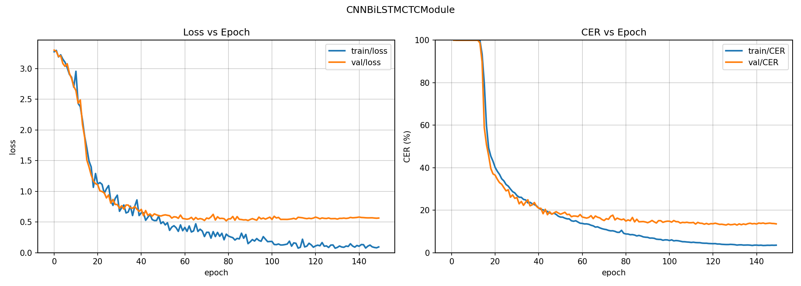

#### CNN-BiLSTM — 300 epochs (Wave 11) — Best Test CER: 8.47% (beam)

Extended training pushes val CER from 13.00% to 12.36%, though returns
diminish after epoch 150. The growing train/val loss gap after epoch 100 shows
mild overfitting, but the model still generalizes well. Beam search brings test
CER to **8.47%**.

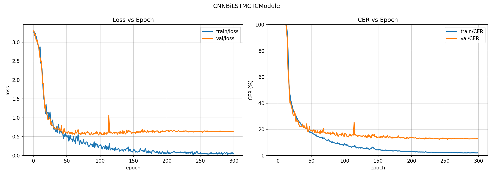

#### ALiBi Transformer — 150 epochs (Wave 10) — Best Test CER: 8.84% (beam + windowed)

The breakthrough transformer result. Unlike sinusoidal-PE transformers that
plateau early with noisy loss curves, the ALiBi variant converges smoothly to
17.41% val CER. Combined with windowed logits merge and beam search, test CER
reaches **8.84%** — proving transformers can match recurrent models when the
positional encoding supports length extrapolation.

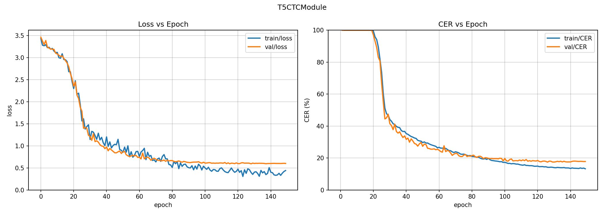

---

### Baseline Controls (Wave 0)

#### TDS-ConvNet — 150 epochs — Val: 19.45% / Test: 22.48%

The original baseline. Convolution-only architecture with local receptive fields.
Converges quickly (escapes blank collapse by epoch 10) and generalizes well
(only 3% val/test gap). Val CER plateaus around 20% after epoch 80.

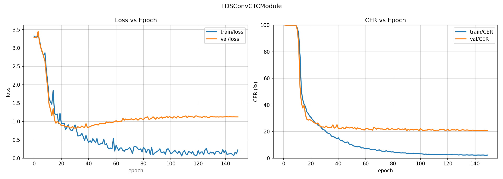

#### Large Transformer + CNN — 80 epochs — Val: 57.95% / Test: 68.06%

Early transformer experiment (d=256, 6 layers). Learning is very slow — CER
stays at 100% through epoch 45, then drops rapidly once attention patterns
stabilize. Only reaches ~60% val CER in 80 epochs. The gap between train and
val CER is small, but both are unacceptably high.

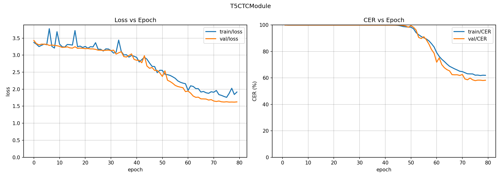

#### Small Transformer + CNN — 80 epochs — Val: 28.47%

Smaller transformer (d=128, 4 layers) with the same slow start but converges
faster relative to the large variant. Val CER reaches ~28% by epoch 80.
Still significantly worse than TDS or recurrent baselines.

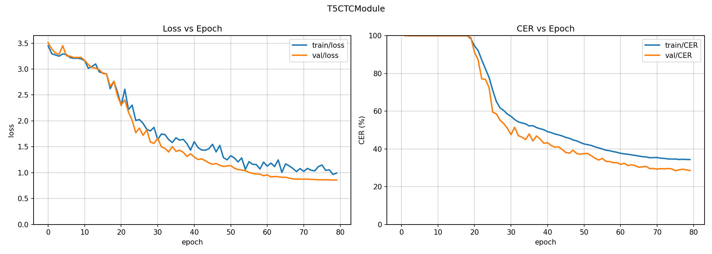

#### Whisper-CTC — 150 epochs — Val: 19.30% / Test: 100%

Whisper-tiny encoder frozen with a trainable CTC head. Achieves a respectable
19.30% val CER (competitive with TDS), but **test CER is 100%** — a complete
generalization failure caused by the same sequence-length issue as pure
transformers. The curves look deceptively healthy because validation uses
windowed data.

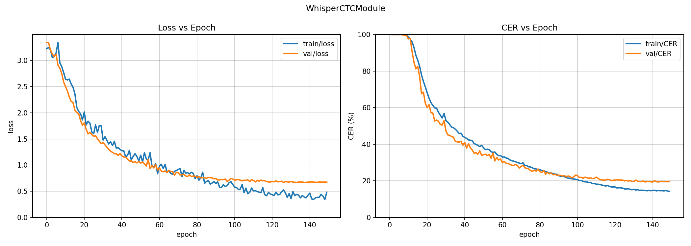

---

### Architecture Sweep (Wave 9 — 150 epochs each)

#### CNN-BiLSTM-Transformer Hybrid — Val: 13.49% / Test: 38.34%

The BiLSTM provides rich sequential context, allowing the transformer to learn
well on validation windows (13.49%). However, the transformer component still
causes a ~25% test generalization gap. The curves show smooth convergence
similar to the pure CNN-BiLSTM but with slightly higher val CER plateau.

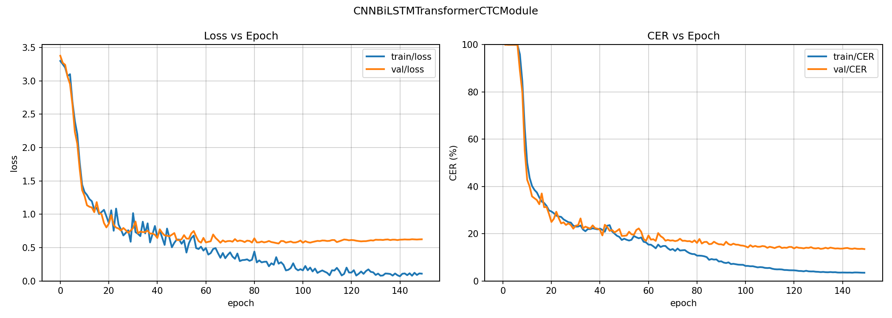

#### Small Transformer (sinusoidal PE) — Val: 15.15% / Test: 87.21%

Isolated transformer with sinusoidal PE, 150 epochs. Converges much better than
the 80-epoch Wave-0 runs — val CER reaches 15.15%. But the 72% val/test gap
confirms that sinusoidal positional encoding fundamentally cannot extrapolate
from 4-second training windows to full test sessions.

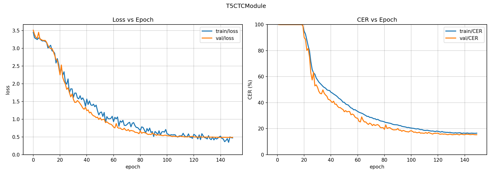

#### Conformer-small (d=128, 4L) — Val: 45.99% / Test: 63.82%

The Conformer combines convolution with self-attention. The training curve
reveals a distinctive pattern: CER stays near 100% for ~60 epochs during the
anti-blank penalty phase, then drops rapidly once the penalty fades. However, it
plateaus at ~46% val CER, suggesting the architecture needs more tuning or
longer training to match its speech recognition performance.

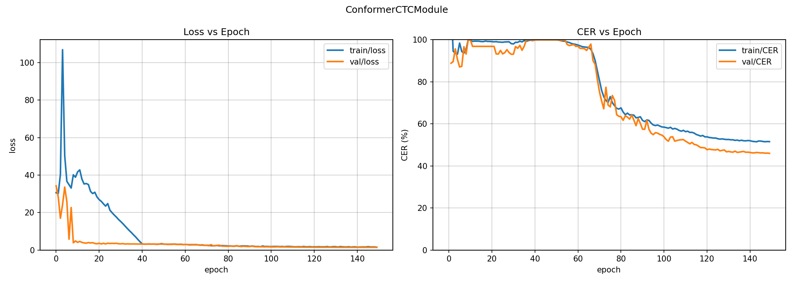

#### Conformer-large (d=256, 6L) — Val: 91.60% / Test: 95.98%

The larger Conformer effectively collapses. The CER curve shows it never escapes
the ~95% region despite loss eventually decreasing. The anti-blank penalty
causes extreme loss spikes (>100) in early training. This configuration is too
large for the available data and training budget.

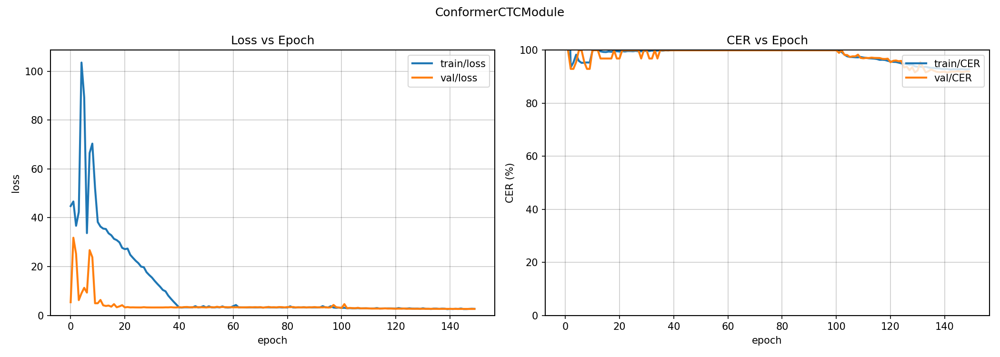

---

### Transformer Fixes (Wave 10 — 150 epochs each)

#### Large Transformer (sinusoidal PE, retrained) — Val: 14.51% / Test: 82.02%

Retrained with 150 epochs (vs. 80 in Wave 0). Val CER improves substantially
from 57.95% to 14.51%, showing the large transformer was simply undertrained
before. However, the sinusoidal PE still causes an enormous 67.5% val/test gap
that windowed inference can only marginally reduce.

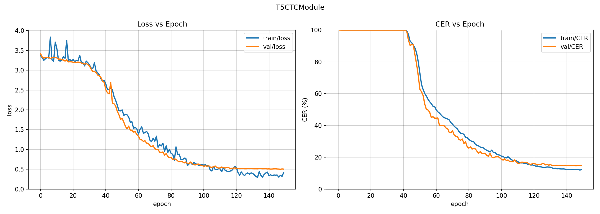

---

### CER Push (Wave 11)

#### CNN-BiLSTM Wide (h=512) — 200 epochs — Val: 14.62% / Test: 16.08%

Wider BiLSTM (512 vs. 384 hidden). The extra capacity doesn't help — val CER
is slightly worse than the standard width model. The curves show a similar
convergence pattern but with a higher val CER floor.

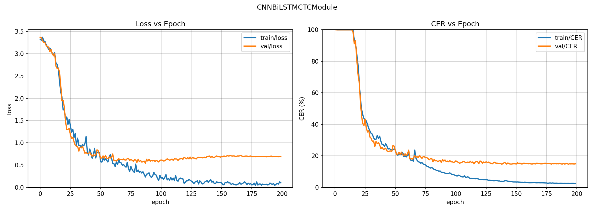

#### CNN-BiLSTM Deep-CNN (3 layers) — 200 epochs — Val: 14.58% / Test: 14.80%

Three-layer CNN ([528, 512, 512]) before the BiLSTM. Notable for the **tightest
val/test gap of any model: only 0.22%**. The deeper CNN provides better local
feature extraction, though absolute CER is slightly worse than the standard
2-layer CNN variant.

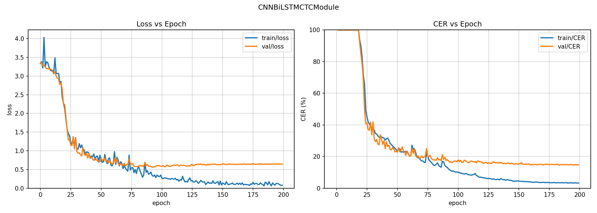

#### BiLSTM-only — 200 epochs — Val: 15.11% / Test: 18.31%

Pure BiLSTM without any CNN front-end. Still reaches a respectable 15.11% val
CER, proving the BiLSTM alone is a strong encoder. The 3.2% val/test gap is
reasonable. With beam search, test CER drops to 10.72%.

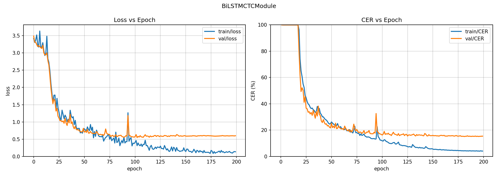

#### Hybrid 300 epochs — Val: 13.03% / Test: 49.49%

Extended training of the CNN-BiLSTM-Transformer hybrid. Val CER marginally
improves to 13.03%, but test CER **worsens** from 38.34% to 49.49% — the extra
training amplifies the transformer's length-dependent overfitting. The
increasing train/val loss divergence after epoch 100 is clearly visible.

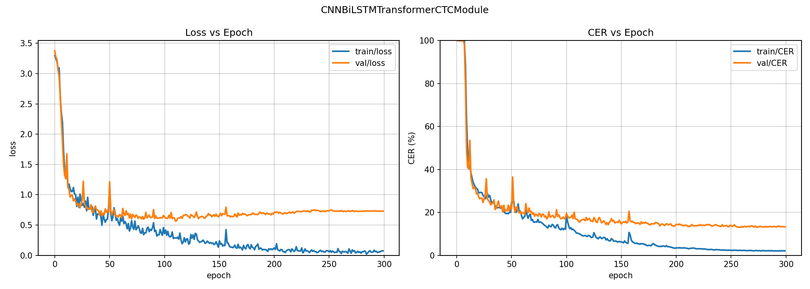

#### Hybrid Large-LSTM (h=384, 3L LSTM + small Trans) — 200 epochs — Val: 18.96%

Larger LSTM (3 layers, h=384) feeding a smaller transformer (d=128, 2 layers).
The hypothesis was that a stronger LSTM could compensate for a smaller
transformer. Instead, val CER is worse (18.96%) and the test gap remains large.
The learning curve is notably slower, with CER still above 100% until epoch 30.

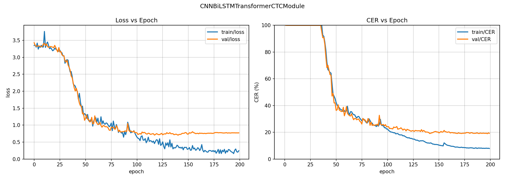

---

## Baseline Results

| Architecture | CER | IER | DER | SER |
|-------------|-----|-----|-----|-----|
| **TDS-ConvNet baseline** | 19.45 / **22.48** | 5.74 / 5.81 | 1.97 / 2.36 | 11.74 / 14.31 |
| **Large Trans + CNN** | **16.79** / 78.52 | 4.32 / 61.16 | 1.62 / 0.13 | 10.86 / 17.22 |
| Small Trans + CNN | 28.71 / 67.54 | 8.88 / 35.34 | 2.17 / 3.70 | 17.66 / 28.51 |
| Trans + CNN, LR=5e-4 | 39.52 / 58.81 | 13.38 / 24.25 | 2.57 / 6.07 | 23.57 / 28.48 |
| Trans + CNN + penalty | 47.76 / 64.82 | 21.62 / 44.35 | 2.22 / 0.91 | 23.93 / 19.56 |
| Pure Transformer | 48.76 / 84.78 | 36.24 / 79.77 | 0.73 / 0.00 | 11.79 / 5.01 |
| Trans + penalty (no CNN) | 94.84 / 98.92 | 94.51 / 98.92 | 0.00 / 0.00 | 0.33 / 0.00 |
| Tiny Transformer | 96.37 / 100.0 | 95.33 / 99.98 | 0.02 / 0.00 | 1.02 / 0.00 |

## Critical Finding: Sequence-Length Generalization Gap

The most important result from this sweep is the **massive val-to-test generalization gap**
in transformer models:

| Model | Val CER | Test CER | Gap |
|-------|---------|----------|-----|
| TDS-ConvNet baseline | 19.45% | 22.48% | **+3.0%** |
| Large Trans + CNN | 16.79% | 78.52% | **+61.7%** |
| Small Trans + CNN | 28.71% | 67.54% | **+38.8%** |

**Why this happens:**

- **Training** uses 4-second windows (8,000 timesteps at 2kHz)
- **Validation** uses the same windowing scheme
- **Test** feeds the **entire session** at once (~140,000 timesteps) without windowing

The transformer's self-attention mechanism (which attends over all positions) cannot
extrapolate from 8K-length sequences to 140K-length sequences. The sinusoidal positional
encoding helps somewhat but is insufficient for a 17.5× length increase.

The baseline **TDS-ConvNet** uses local convolutions with fixed receptive fields, so it
naturally handles arbitrary-length sequences — hence its tiny 3% gap.

**Implications for future work:**
- Use **windowed inference** at test time (sliding window + merge predictions)
- Apply **ALiBi** or **RoPE** positional encodings which extrapolate better
- Train with **variable-length windows** to improve length generalization
- Consider **Conformer** architecture which combines local conv + global attention

## Convergence Curves

### Baseline TDS-ConvNet (GPU 0, 150 epochs)

```
Epoch   0: 1365.1%  (random)
Epoch   1:  100.0%  (blank collapse during LR warmup)
Epoch   9:   99.5%  (warmup finishing → learning starts)
Epoch  10:   93.5%
Epoch  14:   74.9%
Epoch  17:   56.0%
Epoch  19:   40.1%
Epoch  23:   30.2%
Epoch  28:   25.5%
Epoch  42:   21.5%
Epoch  81:   20.0%
Epoch 124:   19.5%  (converged)
```

### Large Transformer + CNN (GPU 5, 80 epochs)

```
Epoch   0: 3497.2%  (random — higher initial CER than baseline)
Epoch   1:  100.0%  (blank collapse)
Epoch  10:   88.3%  (learning starts, slower than baseline)
Epoch  20:   69.1%
Epoch  30:   48.2%
Epoch  38:   33.4%
Epoch  44:   28.3%
Epoch  47:   26.4%
Epoch  60:   19.9%
Epoch  76:   16.8%  (best val CER — beats baseline!)
```

## Architecture Ablation Summary

| Feature | Effect on Val CER | Evidence |
|---------|-------------------|----------|
| **Temporal CNN** | Essential for early learning | CNN variants escape collapse by epoch 10; non-CNN variants stuck until epoch 40+ |
| **Model size** | Larger is better | Large (16.8%) >> Small (28.7%) >> Tiny (96.4%) |
| **Anti-blank penalty** | Harmful | Penalty variants have ~2× worse CER and artificially high losses |
| **Learning rate** | 1e-3 > 5e-4 | Default LR (28.7%) beats 5e-4 (39.5%) |
| **Sequence-length generalization** | TDS >> Transformer | TDS gap: +3%; Transformer gap: +39-62% |

## CTC Blank Collapse with DDP

See [Transformer docs](../models/transformer.md#ddp-pitfall-cer-collapse) for full details
on the CTC blank collapse phenomenon when training with DDP across 8 GPUs. In summary:

- With 8 GPUs: 15 steps/epoch → 150 warmup steps → **permanent blank collapse**
- With 1 GPU: 120 steps/epoch → 1200 warmup steps → **escapes collapse at epoch 10**
- Affected **every architecture**, including the proven TDS-ConvNet baseline

## Training Infrastructure

| Spec | Value |
|------|-------|
| Instance | Verda FIN-03, 8×NVIDIA H200 |
| GPU VRAM | 141 GB each (1128 GB total) |
| CPU / RAM | 176 vCPU, 1450 GB |
| OS | Ubuntu 24.04, CUDA 12.8 |
| Cost | $11.42/hr |
| Baseline (150 ep) | ~25 min |
| Transformer sweep (80 ep × 7) | ~45 min |
| Eval (8 models) | ~5 min |
| **Total session cost** | **~$15** |
| Metric | Validation | Test |
|--------|-----------|------|
| CER (%) | 20.18 | 23.56 |
| DER (%) | 2.22 | 2.36 |
| IER (%) | 4.94 | 5.25 |
| SER (%) | 13.03 | 15.95 |
| Loss | 1.126 | 1.295 |

## CNN + BiLSTM Results

After 150 epochs of training on user 89335547 with `model=cnn_bilstm_ctc`
and greedy decoding, the best checkpoint was saved at epoch 132.


This run improves validation CER from 20.18% to 13.76% and test CER from
23.56% to 14.89% relative to the TDS-CNN baseline on the same single-user split.

| Metric | Validation | Test |
|--------|-----------|------|
| CER (%) | 13.76 | 14.89 |
| DER (%) | 1.77 | 1.36 |
| IER (%) | 3.15 | 2.64 |
| SER (%) | 8.84 | 10.89 |
| Loss | 0.544 | 0.556 |

## Whisper-CTC Results

After 150 epochs of training on user 89335547 with `model=whisper_ctc`
and greedy decoding, the best checkpoint was saved at epoch 143.


This transfer-learning run reached a respectable validation CER, but it does
not generalize to the test split. The failure mode is almost entirely
insertions, which pushes test CER to nearly 100% even though validation loss
and validation CER looked competitive.

| Metric | Validation | Test |
|--------|-----------|------|
| CER (%) | 17.72 | 99.91 |
| DER (%) | 2.55 | 0.00 |
| IER (%) | 4.10 | 99.91 |
| SER (%) | 11.08 | 0.00 |
| Loss | 0.615 | inf |
