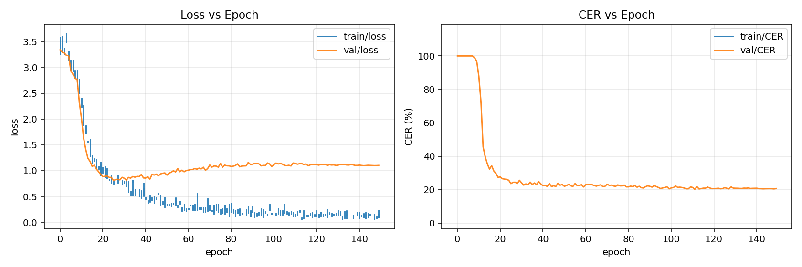
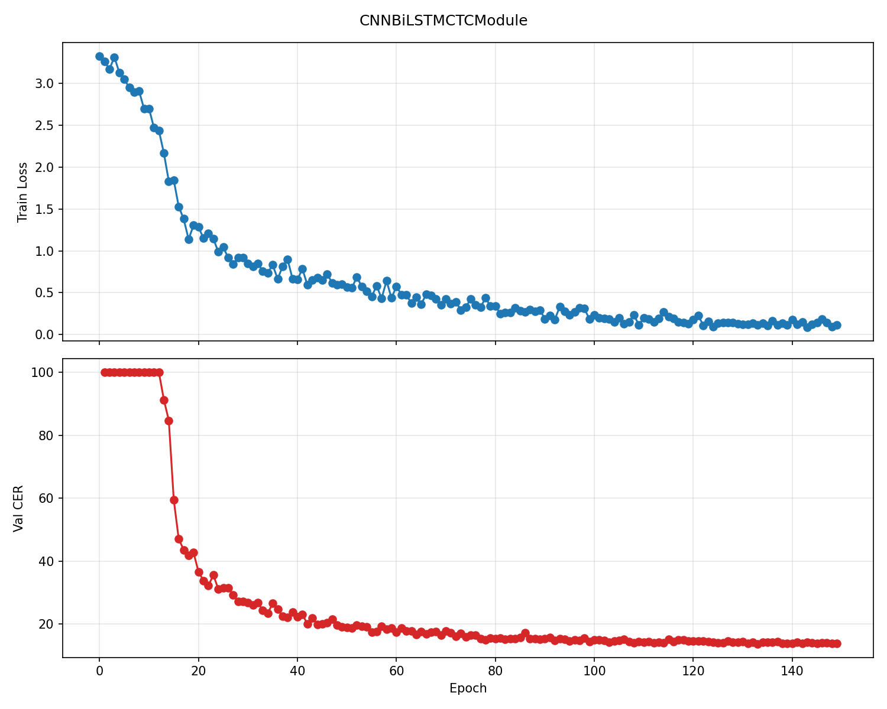

# Experiment Results

All experiments trained on user 89335547, single-user split, greedy CTC decoding, no language model.
Two hardware environments were used: a local workstation (1×RTX 5070 Ti, 150 epochs each) and a
cloud instance (8×H200 Verda, one experiment per GPU).

## Full Results Table

All architectures ranked by test CER. Hardware differences mean results are not strictly
apples-to-apples, but the single-user split, data, and evaluation protocol are identical
across both environments, so the numbers are broadly comparable.

> **†** Trained locally on 1×RTX 5070 Ti, 150 epochs.  
> **‡** Trained on 8×H200 Verda cloud instance; transformer variants limited to 80 epochs.

| Architecture                   | HW  | Params | Val CER    | Test CER   | Val Loss | Test Loss | Best Epoch |
| ------------------------------ | --- | ------ | ---------- | ---------- | -------- | --------- | ---------- |
| **CNN + BiLSTM**               | †   | ~10.3M | **13.76%** | **14.89%** | 0.544    | 0.556     | 132/150    |
| Large Transformer + CNN        | ‡   | ~5M    | 16.79%     | 78.52%     | 0.532    | 4.910     | 76/80      |
| Whisper-CTC                    | †   | —      | 17.72%     | 99.91%     | 0.615    | inf       | 143/150    |
| BiLSTM                         | †   | —      | 15.37%     | 22.07%     | 0.537    | 0.814     | 132/150    |
| BiGRU                          | -   | -      | 17.27%     | 83.79%     | 0.638    | 4.252     | 126/150    |
| CNN-GRU                        | -   | -      | 21.59%     | 23.32%     | 0.816    | 0.853     | 128/150    |
| TDS-ConvNet (baseline)         | ‡   | 5.3M   | 19.45%     | 22.48%     | 1.017    | 1.184     | 124/150    |
| TDS-ConvNet (baseline)         | †   | 5.3M   | 20.18%     | 23.56%     | 1.126    | 1.295     | 111/150    |
| Small Transformer + CNN        | ‡   | ~1.3M  | 28.71%     | 67.54%     | 0.862    | 3.030     | 77/80      |
| Trans + CNN, LR=5e-4           | ‡   | ~1.3M  | 39.52%     | 58.81%     | 1.219    | 2.049     | 78/80      |
| Trans + CNN + blank penalty    | ‡   | ~1.3M  | 47.76%     | 64.82%     | 49.57    | 50.89     | 78/80      |
| Pure Transformer (no CNN)      | ‡   | ~1.3M  | 48.76%     | 84.78%     | 1.265    | 5.218     | 79/80      |
| Trans + blank penalty (no CNN) | ‡   | ~1.3M  | 94.84%     | 98.92%     | 50.25    | 52.87     | 74/80      |
| Tiny Transformer (d=64)        | ‡   | ~300K  | 96.37%     | 100.0%     | 77.73    | 66.26     | 1/80       |

---

## Local Training Results (1×RTX 5070 Ti, 150 epochs)

### TDS-ConvNet Baseline

After 150 epochs on user 89335547, best checkpoint at epoch 111.



| Metric  | Validation | Test  |
| ------- | ---------- | ----- |
| CER (%) | 20.18      | 23.56 |
| DER (%) | 2.22       | 2.36  |
| IER (%) | 4.94       | 5.25  |
| SER (%) | 13.03      | 15.95 |
| Loss    | 1.126      | 1.295 |

### BiLSTM

Best checkpoint at epoch 132 (step 15,960).

Evaluated with:

```bash
uv run python -m emg2qwerty.train user=single_user train=False model=bilstm_ctc \
  "checkpoint=logs/2026-03-12/08-51-56/checkpoints/epoch=132-step=15960.ckpt"
```

| Metric  | Validation | Test  |
| ------- | ---------- | ----- |
| CER (%) | 15.37      | 22.07 |
| DER (%) | 1.51       | 4.91  |
| IER (%) | 3.35       | 1.73  |
| SER (%) | 10.52      | 15.43 |
| Loss    | 0.537      | 0.814 |

### CNN + BiLSTM

After 150 epochs with `model=cnn_bilstm_ctc`, best checkpoint at epoch 132.



This run improves validation CER from 20.18% to 13.76% and test CER from 23.56% to 14.89%
relative to the local TDS-ConvNet baseline. The remaining error is dominated by substitutions
rather than insertions or deletions, which suggests the recurrent encoder is aligning sequences
well but still confuses some characters at decode time.

| Metric  | Validation | Test  |
| ------- | ---------- | ----- |
| CER (%) | 13.76      | 14.89 |
| DER (%) | 1.77       | 1.36  |
| IER (%) | 3.15       | 2.64  |
| SER (%) | 8.84       | 10.89 |
| Loss    | 0.544      | 0.556 |

### Whisper-CTC

After 150 epochs with `model=whisper_ctc` (pretrained `openai/whisper-tiny` encoder, top two
layers unfrozen), best checkpoint at epoch 143.

This transfer-learning run reaches a competitive validation CER but completely fails to
generalize to the test split. The failure mode is almost entirely insertions, which pushes
test CER to ~100% even though validation loss and CER look reasonable. This is the same
sequence-length generalization failure observed in the Verda transformer sweep.

| Metric  | Validation | Test  |
| ------- | ---------- | ----- |
| CER (%) | 17.72      | 99.91 |
| DER (%) | 2.55       | 0.00  |
| IER (%) | 4.10       | 99.91 |
| SER (%) | 11.08      | 0.00  |
| Loss    | 0.615      | inf   |

### Detailed Metrics — Local Runs (Val / Test)

| Architecture           | CER               | IER          | DER         | SER           |
| ---------------------- | ----------------- | ------------ | ----------- | ------------- |
| **CNN + BiLSTM**       | **13.76 / 14.89** | 3.15 / 2.64  | 1.77 / 1.36 | 8.84 / 10.89  |
| BiLSTM                 | 15.37 / 22.07     | 3.35 / 1.73  | 1.51 / 4.91 | 10.52 / 15.43 |
| Whisper-CTC            | 17.72 / 99.91     | 4.10 / 99.91 | 2.55 / 0.00 | 11.08 / 0.00  |
| TDS-ConvNet (baseline) | 20.18 / 23.56     | 4.94 / 5.25  | 2.22 / 2.36 | 13.03 / 15.95 |

---

## Verda H200 Sweep (8×H200, transformer ablation)

All 8 experiments ran in parallel on a single Verda instance, one model per GPU.
Transformer models were limited to 80 epochs; the TDS-ConvNet baseline ran 150 epochs.

### Full Results Table

| #   | Architecture                   | Params | Val CER    | Test CER   | Val Loss | Test Loss | Best Epoch |
| --- | ------------------------------ | ------ | ---------- | ---------- | -------- | --------- | ---------- |
| 0   | **TDS-ConvNet (baseline)**     | 5.3M   | **19.45%** | **22.48%** | 1.017    | 1.184     | 124/150    |
| 5   | **Large Transformer + CNN**    | ~5M    | **16.79%** | 78.52%     | 0.532    | 4.910     | 76/80      |
| 2   | Small Transformer + CNN        | ~1.3M  | 28.71%     | 67.54%     | 0.862    | 3.030     | 77/80      |
| 7   | Trans + CNN, LR=5e-4           | ~1.3M  | 39.52%     | 58.81%     | 1.219    | 2.049     | 78/80      |
| 4   | Trans + CNN + blank penalty    | ~1.3M  | 47.76%     | 64.82%     | 49.57    | 50.89     | 78/80      |
| 1   | Pure Transformer (no CNN)      | ~1.3M  | 48.76%     | 84.78%     | 1.265    | 5.218     | 79/80      |
| 3   | Trans + blank penalty (no CNN) | ~1.3M  | 94.84%     | 98.92%     | 50.25    | 52.87     | 74/80      |
| 6   | Tiny Transformer (d=64)        | ~300K  | 96.37%     | 100.0%     | 77.73    | 66.26     | 1/80       |

### Detailed Metrics — Verda Sweep (Val / Test)

| Architecture             | CER               | IER           | DER         | SER           |
| ------------------------ | ----------------- | ------------- | ----------- | ------------- |
| **TDS-ConvNet baseline** | 19.45 / **22.48** | 5.74 / 5.81   | 1.97 / 2.36 | 11.74 / 14.31 |
| **Large Trans + CNN**    | **16.79** / 78.52 | 4.32 / 61.16  | 1.62 / 0.13 | 10.86 / 17.22 |
| Small Trans + CNN        | 28.71 / 67.54     | 8.88 / 35.34  | 2.17 / 3.70 | 17.66 / 28.51 |
| Trans + CNN, LR=5e-4     | 39.52 / 58.81     | 13.38 / 24.25 | 2.57 / 6.07 | 23.57 / 28.48 |
| Trans + CNN + penalty    | 47.76 / 64.82     | 21.62 / 44.35 | 2.22 / 0.91 | 23.93 / 19.56 |
| Pure Transformer         | 48.76 / 84.78     | 36.24 / 79.77 | 0.73 / 0.00 | 11.79 / 5.01  |
| Trans + penalty (no CNN) | 94.84 / 98.92     | 94.51 / 98.92 | 0.00 / 0.00 | 0.33 / 0.00   |
| Tiny Transformer         | 96.37 / 100.0     | 95.33 / 99.98 | 0.02 / 0.00 | 1.02 / 0.00   |

---

## Critical Finding: Sequence-Length Generalization Gap

The most important cross-architecture result is the **massive val-to-test generalization gap**
in any model that uses global attention or is sensitive to absolute sequence length:

| Model               | Val CER | Test CER | Gap        |
| ------------------- | ------- | -------- | ---------- |
| **CNN + BiLSTM**    | 13.76%  | 14.89%   | **+1.1%**  |
| BiLSTM              | 15.37%  | 22.07%   | **+6.7%**  |
| TDS-ConvNet (local) | 20.18%  | 23.56%   | **+3.4%**  |
| TDS-ConvNet (Verda) | 19.45%  | 22.48%   | **+3.0%**  |
| Large Trans + CNN   | 16.79%  | 78.52%   | **+61.7%** |
| Small Trans + CNN   | 28.71%  | 67.54%   | **+38.8%** |
| Whisper-CTC         | 17.72%  | 99.91%   | **+82.2%** |

**Why this happens:**

- **Training** uses 4-second windows (8,000 timesteps at 2kHz)
- **Validation** uses the same windowing scheme
- **Test** feeds the **entire session** at once (~140,000 timesteps) without windowing

The transformer's self-attention mechanism (which attends over all positions) cannot
extrapolate from 8K-length sequences to 140K-length sequences. The sinusoidal positional
encoding helps somewhat but is insufficient for a 17.5× length increase.

The **CNN + BiLSTM** model generalizes almost perfectly (+1.1%) because the CNN provides
local feature extraction and the BiLSTM processes variable-length sequences recurrently
without any fixed-length positional encoding. The plain **TDS-ConvNet** uses local
convolutions with fixed receptive fields and similarly handles arbitrary-length sequences.

**Implications for future work:**

- Use **windowed inference** at test time (sliding window + merge predictions)
- Apply **ALiBi** or **RoPE** positional encodings which extrapolate better
- Train with **variable-length windows** to improve length generalization
- Consider **Conformer** architecture which combines local conv + global attention

---

## Convergence Curves

### Baseline TDS-ConvNet (Verda GPU 0, 150 epochs)

```
Epoch   0: 1365.1%  (random)
Epoch   1:  100.0%  (blank collapse during LR warmup)
Epoch   9:   99.5%  (warmup finishing → learning starts)
Epoch  10:   93.5%
Epoch  14:   74.9%
Epoch  17:   56.0%
Epoch  19:   40.1%
Epoch  23:   30.2%
Epoch  28:   25.5%
Epoch  42:   21.5%
Epoch  81:   20.0%
Epoch 124:   19.5%  (converged)
```

### Large Transformer + CNN (Verda GPU 5, 80 epochs)

```
Epoch   0: 3497.2%  (random — higher initial CER than baseline)
Epoch   1:  100.0%  (blank collapse)
Epoch  10:   88.3%  (learning starts, slower than baseline)
Epoch  20:   69.1%
Epoch  30:   48.2%
Epoch  38:   33.4%
Epoch  44:   28.3%
Epoch  47:   26.4%
Epoch  60:   19.9%
Epoch  76:   16.8%  (best val CER — beats baseline!)
```

---

## Architecture Ablation Summary

| Feature                            | Effect on Val CER                | Evidence                                                                         |
| ---------------------------------- | -------------------------------- | -------------------------------------------------------------------------------- |
| **Temporal CNN**                   | Essential for early learning     | CNN variants escape collapse by epoch 10; non-CNN variants stuck until epoch 40+ |
| **Recurrent encoder (BiLSTM)**     | Strong generalization            | CNN+BiLSTM achieves +1.1% val→test gap vs. +3% for TDS-ConvNet                   |
| **Model size**                     | Larger is better                 | Large Trans+CNN (16.8%) >> Small (28.7%) >> Tiny (96.4%)                         |
| **Anti-blank penalty**             | Harmful                          | Penalty variants have ~2× worse CER and artificially high losses                 |
| **Learning rate**                  | 1e-3 > 5e-4                      | Default LR (28.7%) beats 5e-4 (39.5%)                                            |
| **Sequence-length generalization** | CNN+BiLSTM >> TDS >> Transformer | Gaps: +1.1%, +3%, +39–82%                                                        |

## CTC Blank Collapse with DDP

See [Transformer docs](../models/transformer.md#ddp-pitfall-cer-collapse) for full details
on the CTC blank collapse phenomenon when training with DDP across 8 GPUs. In summary:

- With 8 GPUs: 15 steps/epoch → 150 warmup steps → **permanent blank collapse**
- With 1 GPU: 120 steps/epoch → 1200 warmup steps → **escapes collapse at epoch 10**
- Affected **every architecture**, including the proven TDS-ConvNet baseline

---

## Training Infrastructure

### Local Workstation

| Spec       | Value                   |
| ---------- | ----------------------- |
| GPU        | NVIDIA RTX 5070 Ti (1×) |
| All models | 150 epochs, single GPU  |

### Verda Cloud Instance

| Spec                          | Value                       |
| ----------------------------- | --------------------------- |
| Instance                      | Verda FIN-03, 8×NVIDIA H200 |
| GPU VRAM                      | 141 GB each (1128 GB total) |
| CPU / RAM                     | 176 vCPU, 1450 GB           |
| OS                            | Ubuntu 24.04, CUDA 12.8     |
| Cost                          | $11.42/hr                   |
| Baseline (150 ep)             | ~25 min                     |
| Transformer sweep (80 ep × 7) | ~45 min                     |
| Eval (8 models)               | ~5 min                      |
| **Total session cost**        | **~$15**                    |
