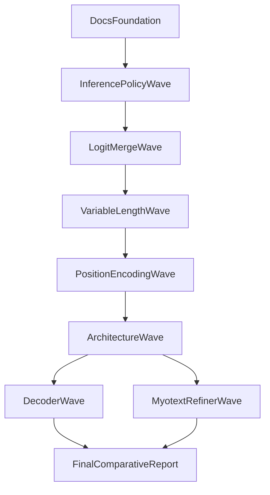

# Transformer Troubleshooting

## Campaign Objective

This page tracks the recovery campaign for transformer-family models on the
`yahvin/transformer-troubleshoot` branch. The goal is not merely to lower
windowed validation CER, but to produce a transformer-family model that remains
competitive on full-session test evaluation.

The current blocker is a large test-time generalization failure:

| Model | Train/Val regime | Test regime | Outcome |
|---|---|---|---|
| `tds_conv_ctc` | 4-second windows | full session | small val/test gap |
| `t5_ctc` family | 4-second windows | full session | catastrophic val/test gap |
| `whisper_ctc` | 4-second windows | full session | insertion-heavy test collapse |

## Failure Taxonomy

| Failure mode | Symptom | Current evidence | Planned mitigation |
|---|---|---|---|
| Sequence-length mismatch | Good val CER, bad test CER | Transformer `16.79 -> 78.52` | windowed inference, variable-length training |
| Positional extrapolation failure | Long sequence instability | sinusoidal PE trained on 8k, tested on ~140k | ALiBi, RoPE |
| Early CTC blank collapse | 100% CER under DDP | observed across transformer and baseline | single GPU per run, warmup discipline |
| Insertion-heavy decoding | huge IER on test | Whisper-CTC test collapse | logit stitching, beam/LM eval, refiner |
| Weak local inductive bias | poor early transformer learning | non-CNN variants trail CNN variants badly | Conformer, raw CNN frontend |

## Execution Model

The troubleshooting campaign uses the Verda `8x RTX PRO 6000` instance as an
8-lane experiment cluster:

| Resource | Value |
|---|---|
| GPUs | 8x RTX PRO 6000 |
| Per-GPU VRAM | ~96 GB |
| CPU | 240 vCPU |
| RAM | 720 GB |
| Usage model | 1 GPU per independent run |



## Wave Ledger Template

Every experiment wave should populate the following table before launch and fill
in the result columns when runs complete.

| Wave | GPU slot | Model | Commit SHA | Inference mode | Train window regime | Positional encoding | Frontend | Decoder | Status | Checkpoint | Train CER | Val CER | Test CER | Notes |
|---|---:|---|---|---|---|---|---|---|---|---|---:|---:|---:|---|
| wave-0-template | 0 | example | pending | pending | pending | pending | pending | pending | planned | — | — | — | — | template row |

## Wave 1 Launch Template

```bash
export TDS_CKPT=/root/checkpoints/tds_best.ckpt
export LARGE_TRANSFORMER_CKPT=/root/checkpoints/transformer_large_best.ckpt
export SMALL_TRANSFORMER_CKPT=/root/checkpoints/transformer_small_best.ckpt
export WHISPER_CKPT=/root/checkpoints/whisper_best.ckpt

bash scripts/wave1_inference_sweep.sh
```

## Inference Policy Comparison Template

| Policy | Window length | Stride | Trim margin | Merge strategy | Model | Val CER | Test CER | IER | DER | SER | Notes |
|---|---:|---:|---:|---|---|---:|---:|---:|---:|---:|---|
| full_session | — | — | — | none | `t5_ctc_large` | — | — | — | — | — | baseline |

## Length Generalization Comparison Template

| Model | Train windows | Curriculum | Positional encoding | Test inference | Val CER | Test CER | Gap | Notes |
|---|---|---|---|---|---:|---:|---:|---|
| `t5_ctc_large` | `4s` | none | sinusoidal | full_session | — | — | — | control |

## Architecture Comparison Template

| Family | Frontend | Encoder | Downsample | Positional encoding | Decoder | Val CER | Test CER | Params | Status | Notes |
|---|---|---|---:|---|---|---:|---:|---:|---|---|
| transformer | spectrogram | transformer | 1x | sinusoidal | greedy | — | — | — | planned | control |

## MyoText-Style Refiner Template

| Stage A | Stage B | Input to refiner | Decoder | Val CER | Test CER | Delta vs stage A | Notes |
|---|---|---|---|---:|---:|---:|---|
| `cnn_bilstm_ctc` | none | — | greedy | — | — | — | control |

## Promotion Criteria

An experiment is promoted to the next wave only if it satisfies all of the
following:

1. It beats or matches the current best transformer-family `test/CER`.
2. Its val/test gap is smaller than the outgoing control.
3. It does not rely on an unstable failure mode such as extreme insertions.
4. It remains reproducible on a rerun or close replication.

## Negative Results Policy

Negative results are retained rather than deleted. Each failed run should record:

- failure category
- earliest clear symptom
- whether the issue is optimization, decoding, or inference mismatch
- whether the run was killed early or completed
- exact command/config used
