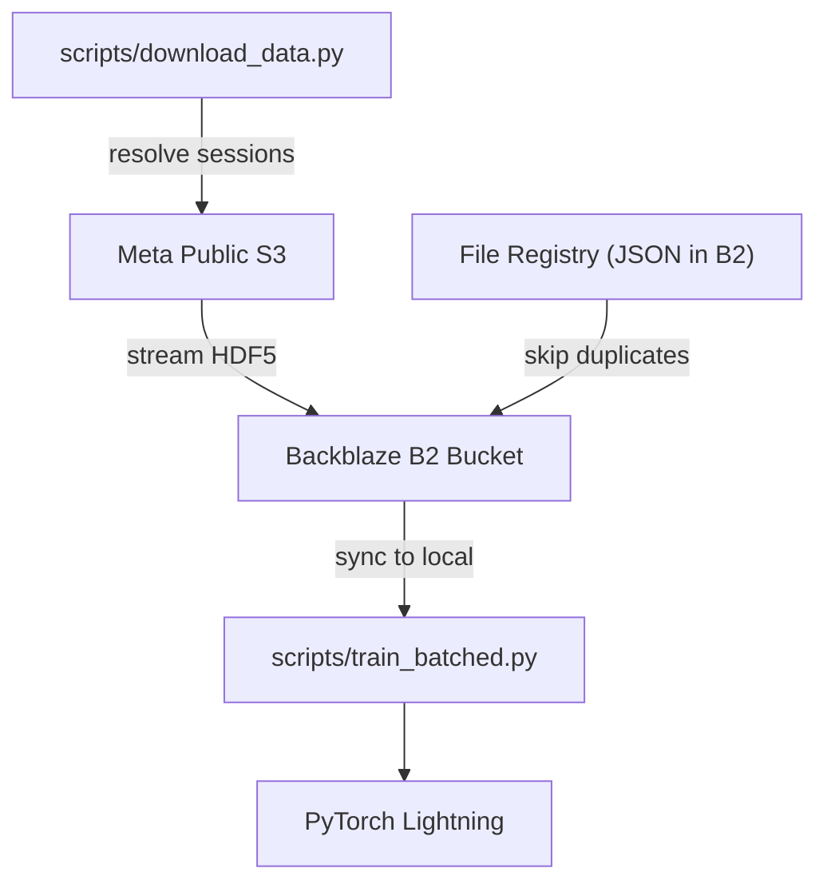

# Data Pipeline

This section describes the reproducible data-download and batched-training pipeline used to manage the emg2qwerty dataset across Meta's public S3 bucket and our Backblaze B2 storage.

## Architecture



## Quick Start

```bash
# 1. Set up credentials
cp .env.example .env
# Edit .env with your B2_KEY_ID and B2_APPLICATION_KEY

# 2. Download baseline data (~2-9 GB)
make download-baseline

# 3. Train on baseline profile
make train-baseline
```

## Download Modes

| Flag | Description | Users | Sessions | ~Size |
|------|-------------|-------|----------|-------|
| `--baseline` | Single user 89335547 | 1 | 18 | 2-9 GB |
| `--test` | 10 random users | 10 | ~50-100 | 10-50 GB |
| `--all` | All users | ~108 | ~800+ | ~200 GB |

## Components

- **[Download Script](download.md)** — `scripts/download_data.py`
- **[Training Script](training.md)** — `scripts/train_batched.py`
- **File Registry** — JSON manifest in B2 that tracks uploaded files to prevent duplication
- **rclone** — Optional alternative for manual data access (`make rclone-setup`)
