# Data Pipeline

This section describes the reproducible data-download and batched-training
pipeline used to manage the emg2qwerty dataset across Meta's public S3 archive
and our Backblaze B2 storage.

## Architecture

```mermaid
flowchart TD
    CLI["scripts/download_data.py<br/>(Click CLI)"]
    Meta["Meta Public S3<br/>(308 GB tar.gz)"]
    Stream["tarfile.open(mode='r&#124;gz')<br/>stream-filter"]
    Registry["FileRegistry<br/>(JSON in B2)"]
    B2["Backblaze B2 Bucket"]
    Local["Local data/"]
    Train["scripts/train_batched.py"]
    Lightning["PyTorch Lightning<br/>Trainer"]

    CLI -->|"resolve sessions"| Meta
    Meta -->|"HTTPS stream"| Stream
    Stream -->|"extract HDF5s"| Local
    Stream -->|"upload via boto3"| B2
    Registry -->|"skip duplicates"| Stream
    B2 -->|"rclone sync"| Local
    Local --> Train
    Train --> Lightning
```



## How It Works

The Meta emg2qwerty dataset is distributed as a single **gzip-compressed tar
archive** (~308 GB). Individual object access to the S3 bucket is denied; the
entire archive must be streamed.

Our pipeline:

1. **Resolves sessions** — based on `--baseline` / `--test` / `--all`, determines
   which `(user_id, session_id)` pairs are needed.
2. **Checks the registry** — a JSON manifest in B2 tracks which files have
   already been uploaded. Only new files are processed.
3. **Streams the tar.gz** — uses `requests.get(url, stream=True)` to open an
   HTTPS connection and `tarfile.open(fileobj=response.raw, mode='r|gz')` to
   decompress on the fly.
4. **Filters members** — as each tar member is encountered, checks if it matches
   a pending session. If so, extracts the content.
5. **Saves locally + uploads to B2** — extracted HDF5 files are saved to `data/`
   and uploaded to the B2 bucket via `boto3.put_object`.
6. **Updates the registry** — after each upload, records the file's metadata
   (source key, B2 key, size, etag, timestamp) in the registry and saves it
   back to B2.

## Quick Start

```bash
# 1. Set up credentials
cp .env.example .env
# Edit .env with your B2_KEY_ID and B2_APPLICATION_KEY

# 2. Download baseline data (streams tar.gz, extracts 18 sessions)
uv run python scripts/download_data.py --baseline

# 3. Train on baseline profile
uv run python scripts/train_batched.py --baseline
```

## Download Modes

| Flag | Description | Users | Sessions | ~Size |
|------|-------------|-------|----------|-------|
| `--baseline` | Single user 89335547 | 1 | 18 | 2–9 GB |
| `--test` | 10 random users | 10 | ~50–100 | 10–50 GB |
| `--all` | All users | ~108 | ~800+ | ~200 GB |

!!! warning "Large download"
    The `--all` flag streams through the entire 308 GB tar.gz archive.
    This requires a fast internet connection and several hours. Consider
    using `--test` for development and evaluation.

## Components

- **[Download Script](download.md)** — `scripts/download_data.py`
- **[Training Script](training.md)** — `scripts/train_batched.py`
- **File Registry** — JSON manifest in B2 that tracks uploaded files to prevent duplication
- **rclone** — Optional alternative for manual data access (`make rclone-config`)

## Dependencies

The pipeline uses these Python packages (all included in `pyproject.toml`):

| Package | Purpose |
|---|---|
| `boto3` / `botocore` | S3-compatible API for Backblaze B2 uploads |
| `requests` | HTTPS streaming of the Meta tar.gz archive |
| `pydantic` | Configuration validation |
| `python-dotenv` | Loading B2 credentials from `.env` |
| `click` | CLI argument parsing |
| `pandas` | Metadata CSV processing |
| `h5py` | HDF5 file validation |
| `tqdm` | Progress bars |
